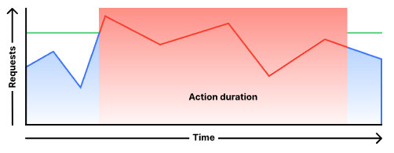
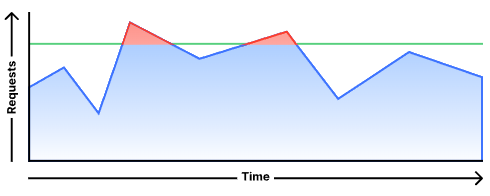

# Programmable Rate-Limiter for Cloudflare Durable Objects

This is a programmable Rate-Limiter written in Typescript that can be deployed to Cloudflare Workers.

Because we need strong consistency when rate-limiting on a per-request basis, this implementation uses Cloudflare's 
Durable Objects

## Rate-Limit Configuration

There are at least three variables, that have to be taken into account, when deploying a Rate-Limit
- How to identify a client
- How many requests we allow from this client
- (Optional) In which period of time

### Rate-Limit Behavior

Additionally, we have to think about what happens when this Rate-Limit exceeds.  This Worker script supports 
two modes.

#### Blocking

Let's say we allow 10 requests per 10 seconds. If a clients exceeds this threshold - before the time 
window ends - we will block **all** requests from this client for a specified amount of time.



*From [Cloudflare Blog - Rate Limiting analytics and throttling](https://blog.cloudflare.com/new-rate-limiting-analytics-and-throttling/)*

#### Throttling

Instead of blocking all requests within the configured time window, a throttling behavior can be used. A client 
exceeding the configured threshold of 10 requests per 10 seconds, will still be able to make at least 1 successful 
request per second. All other requests will be blocked.



*From [Cloudflare Blog - Rate Limiting analytics and throttling](https://blog.cloudflare.com/new-rate-limiting-analytics-and-throttling/)*

### Configuration Example #1

This repo contains a `default` configuration that should serve as an example:
```javascript
async default(request: Request): Promise<[string, Configuration]> {
    const ident = request.headers.get('cf-connecting-ip') || '127.0.0.1';

    const configuration = new Configuration(
        request.headers.get('_requests'),
        request.headers.get('_per_seconds'),
        Behavior.Blocking
    );

    return [ident, configuration];
}
```

In this example 
- to identify client's we are using their source IP address
- we read the number of allowed requests from a request header called `_requests`
- we read the time-frame (in seconds) from a request header called `_per_seconds`

If a client exceeds this threshold, we will block the client for `_per_seconds` seconds.

### Configuration Example #2

Let's imagine we run an API service that issues JWTs to clients. 

```
{
  "iss": "Issuer",
  "iat": 1702211388,
  "exp": 1733747388,
  "aud": "example.com",
  "sub": "Customer",
  "requests": "500",
  "per_seconds": "10"
}
```

Each JWT contains two claims
- `requests`: The number of requests this client is able to do
- `per_seconds`: (Optional, but relevant for this example) Time window for those requests

Instead of blocking all requests from this client for the configured number of seconds, we can use a throttling
behavior.

```javascript
async jwt(request: Request): Promise<[string, Configuration]> {
    try {
        // Get JWT from request header
        const token = request.headers.get('api-key') || '';

        // Decode Jwt
        const jwt = jwtDecode(token);

        // Rate-Limit based on JWT subject
        const ident = jwt.sub || '';

        // Get Rate-Limit configuration from two JWT claims 'requests' and 'per_seconds'
        const configuration = new Configuration(
            jwt.requests,
            jwt.per_seconds,
            Behavior.Throttling
        );

        return [ident, configuration];
    } catch(ex) {
        // Use default config if we can't decode the JWT
        return await this.default(request);
    }
},
```

In case something went wrong decoding the JWT, we fall-back to the `default` behavior from Example #1.

Important: This example does not verify JWT signatures. When used in production you also want to verify the JWT's
signature against a JWKS.

[Cloudflare Workers Web Crypto Runtime APIs](https://developers.cloudflare.com/workers/runtime-apis/web-crypto/) can be 
used for this.

### More examples in a nutshell

- Allow a maximum of 10 requests. 
- No more requests are allowed.

```javascript
const configuration = new Configuration(10, null, Behavior.Blocking);
```

- Allow 10 requests per 10 seconds. 
- Then Block all requests for 10 seconds. 
- After 10 seconds 10 more requests are allowed. And so on.

```javascript
const configuration = new Configuration(10, 10, Behavior.Blocking);
```

- Allow 20 requests per 10 seconds. 
- Then throttle all requests. 
- Every 1 second the client's allowed number of requests increases by 2
- Up to the maximum of 20 requests

```javascript
const configuration = new Configuration(20, 10, Behavior.Throttling);
```

## Strong consistency

Durable Object's strong consistency model can be observed with a simple test using Apache Bench. Let's say our
configuration allows for 1000 requests in a 20 seconds time window. Clients exceeding this Rate-Limit will be blocked.

```javascript
const configuration = new Configuration(1000, 20, Behavior.Blocking);
```

If we run 1001 requests using Apache Bench with a concurrency level of 100, we can see that the 1001st request will be 
rate-limited:

```
Concurrency Level:      100
Time taken for tests:   3.123 seconds
Complete requests:      1001
Failed requests:        1
   (Connect: 0, Receive: 0, Length: 1, Exceptions: 0)
Non-2xx responses:      1
```

## Worker Setup
Create a `wrangler.toml` file in the root directory. Make sure you replace your Account ID and the URL path you want to
enforce Rate-Limits on.

```
name = "rate-limiter"
main = "src/index.ts"
compatibility_date = "2023-12-06"
account_id = "<Your Account ID>"
route = { pattern = "<The URL pattern you want to enforce Rate-Limits on>", zone_name = "<Your zone name>" }

[[durable_objects.bindings]]
name = "COUNTER"
class_name = "Counter"

[[migrations]]
tag = "v1"
new_classes = ["Counter"]
```

## Deploy
Make sure you have [Cloudflare Wrangler](https://developers.cloudflare.com/workers/wrangler/install-and-update/) installed

Deploy the Worker script with:
```
$ wrangler deploy
```

Alternatively you can test all of this locally using Wrangler as well:
```
$ wrangler dev
```